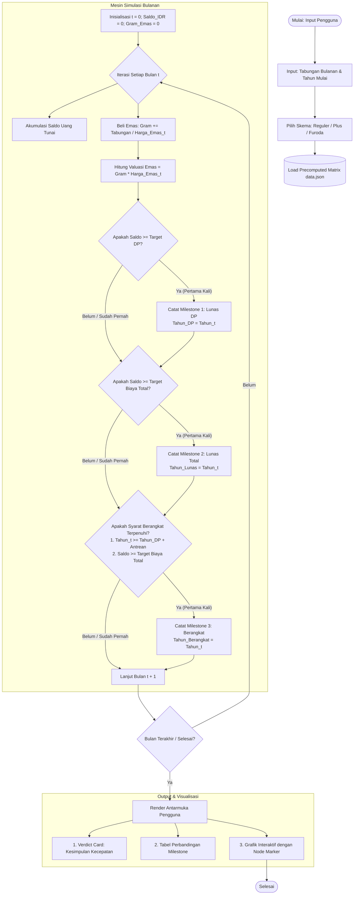

# 🕋 Salimah: Simulator Perencanaan Tabungan Haji (Emas vs Rupiah)

[](https://irfanwk.github.io/Simulasi-Tabungan-Haji/)
[](./research/Research.ipynb)
[](./index.html)
[](#-tim-pelaksana--pengabdian-masyarakat)

Aplikasi kalkulator dan simulator finansial interaktif berbasis *data science* dan *machine learning* untuk membantu calon jemaah haji merencanakan estimasi keberangkatan ke Tanah Suci. Sistem ini membandingkan efektivitas menabung dengan **Uang Tunai (Rupiah)** versus **Emas Batangan (Logam Mulia)** dalam mengimbangi laju inflasi biaya ibadah haji, fluktuasi kurs mata uang asing, dan masa tunggu antrean riil di Indonesia.

🔗 **Akses Langsung Aplikasi:** [https://irfanwk.github.io/Simulasi-Tabungan-Haji/](https://irfanwk.github.io/Simulasi-Tabungan-Haji/)

---

## 📋 Daftar Isi
1. [Latar Belakang & Masalah](#-latar-belakang--masalah)
2. [Arsitektur & Landasan Model Matematika](#-arsitektur--landasan-model-matematika)
   - [A. Model Proyeksi Kurs Valuta Asing (Holt-Winters)](#a-model-proyeksi-kurs-valuta-asing-holt-winters-exponential-smoothing)
   - [B. Model Stokastik Harga Emas (Geometric Brownian Motion)](#b-model-stokastik-harga-emas-geometric-brownian-motion---gbm)
   - [C. Model Proyeksi Biaya Haji (Logistic Growth Model)](#c-model-proyeksi-biaya-haji-logistic-growth-model)
3. [Alur Workflow Estimasi Keberangkatan Haji](#-alur-workflow-estimasi-keberangkatan-haji)
   - [Diagram Alir Sistem (Simulation Pipeline)](#diagram-alir-sistem-simulation-pipeline)
   - [Matriks Skema Haji & Ketentuan Antrean](#matriks-skema-haji--ketentuan-antrean)
   - [Formulasi Akumulasi & Penentuan 3 Milestone Kunci](#formulasi-akumulasi--penentuan-3-milestone-kunci)
4. [Fitur Unggulan & Pengalaman Pengguna (UX)](#-fitur-unggulan--pengalaman-pengguna-ux)
5. [Struktur Direktori Repositori](#-struktur-direktori-repositori)
6. [Panduan Instalasi & Menjalankan Lokal](#-panduan-instalasi--menjalankan-lokal)
7. [Tim Pelaksana & Pengabdian Masyarakat](#-tim-pelaksana--pengabdian-masyarakat)

---

## 🎯 Latar Belakang & Masalah

Ibadah Haji merupakan rukun Islam kelima yang wajib dilaksanakan bagi setiap Muslim yang mampu (*istitha'ah*). Di Indonesia, realisasi keberangkatan haji menghadapi tantangan multidimensi:

1. **Masa Tunggu Antrean Riil yang Sangat Panjang:** Kuota haji nasional yang terbatas dibandingkan animo pendaftar menyebabkan antrean Haji Reguler mencapai **25 hingga 30 tahun** di berbagai kabupaten/kota (khususnya di Jawa Barat dan Kabupaten Bogor).
2. **Erosi Nilai Akibat Inflasi Riil:** Menabung uang tunai konvensional selama puluhan tahun rentan terhadap penurunan daya beli (*purchasing power depreciation*). Komponen Biaya Perjalanan Ibadah Haji (Bipih/BPIH) yang mencakup penerbangan, akomodasi perhotelan di Makkah/Madinah, dan layanan Masyair sangat bergantung pada nilai tukar Dolar AS (USD) dan Riyal Saudi (SAR).
3. **Kebutuhan Edukasi Berbasis Sains:** Masyarakat seringkali terjebak dalam dilema finansial: *apakah menabung uang kertas cukup, ataukah mengalokasikan tabungan ke dalam emas fisik mampu mempercepat keberangkatan dan mengamankan biaya pelunasan?*

Proyek ini dibangun sebagai bagian dari program **Pengabdian kepada Masyarakat (PkM) 2026** oleh civitas akademika **Universitas Pertamina** bersama **Pimpinan Daerah Persaudaraan Muslimah (Salimah) Kabupaten Bogor** untuk menghadirkan solusi edukasi finansial yang presisi, mudah diakses, dan berbasis metodologi kuantitatif yang dapat dipertanggungjawabkan.

---

## 🔬 Arsitektur & Landasan Model Matematika

Dataset simulasi jangka panjang bulanan (`data.json`) tidak dibangun dari asumsi linear sederhana, melainkan diestimasi menggunakan kombinasi tiga teknik pemodelan matematika dan *time series forecasting* pada [notebook riset](./research/Research.ipynb):

```
                       ┌───────────────────────────────┐
                       │    Data Historis 2010-2026    │
                       └───────────────┬───────────────┘
                                       │
         ┌─────────────────────────────┼─────────────────────────────┐
         ▼                             ▼                             ▼
┌──────────────────┐          ┌──────────────────┐          ┌──────────────────┐
│  Kurs Transaksi  │          │   Harga Emas     │          │    BPIH Kemenag  │
│     USD/IDR      │          │   Antam (IDR)    │          │  Reguler & Furoda│
└────────┬─────────┘          └────────┬─────────┘          └────────┬─────────┘
         ▼                             ▼                             ▼
┌──────────────────┐          ┌──────────────────┐          ┌──────────────────┐
│   Holt-Winters   │          │Geometric Brownian│          │ Logistic Growth  │
│  Exp. Smoothing  │          │   Motion (GBM)   │          │   Model Curve    │
└────────┬─────────┘          └────────┬─────────┘          └────────┬─────────┘
         │                             │                             │
         └─────────────────────────────┼─────────────────────────────┘
                                       ▼
                       ┌───────────────────────────────┐
                       │  Tabel Proyeksi Bulanan ke-t  │
                       │    (Kurs, Emas, Biaya Haji)   │
                       └───────────────┬───────────────┘
                                       ▼
                       ┌───────────────────────────────┐
                       │  Simulasi Tabungan Finansial  │
                       │   (Rupiah vs Logam Mulia)     │
                       └───────────────────────────────┘
```

---

### A. Model Proyeksi Kurs Valuta Asing: Holt-Winters Exponential Smoothing

* **Metode:** *Double Exponential Smoothing* (Additive Trend, Non-Seasonal)
* **Pustaka:** `statsmodels.tsa.holtwinters.ExponentialSmoothing`
* **Data Input:** Data historis nilai tukar Kurs Jual Transaksi USD terhadap IDR harian Bank Indonesia (2010–2026), di-*resample* menjadi rata-rata bulanan.

#### Formulasi Matematis:
Model memperbarui komponen *Level* ($L_t$) dan *Trend* ($b_t$) pada setiap langkah waktu $t$ secara adaptif:
$$\begin{aligned}
L_t &= \alpha Y_t + (1 - \alpha)(L_{t-1} + b_{t-1}) \\
b_t &= \beta (L_t - L_{t-1}) + (1 - \beta) b_{t-1} \\
\hat{Y}_{t+h} &= L_t + h \cdot b_t
\end{aligned}$$
*di mana:*
* $Y_t$ = Nilai tukar riil pada bulan $t$.
* $\alpha \in [0, 1]$ = Parameter pemulusan level (*smoothing level coefficient*).
* $\beta \in [0, 1]$ = Parameter pemulusan tren (*smoothing trend coefficient*).
* $h$ = Horizon langkah peramalan masa depan (diproyeksikan hingga tahun 2070).

#### Alasan Pemilihan Model:
1. **Dinamika Non-Musiman:** Kurs valuta asing makro tidak memiliki siklus musiman tahunan kalender yang kaku (*no seasonality*), namun memiliki tren kenaikan struktural jangka panjang akibat perbedaan tingkat inflasi riil (*Purchasing Power Parity*).
2. **Kestabilan Ekstrapolasi:** Dibandingkan model ARIMA ordo tinggi yang dapat mengalami osilasi liar saat diekstrapolasikan untuk jangka waktu panjang (20–40 tahun), Holt-Winters dengan *additive trend* menghasilkan peramalan kemiringan (*slope*) linear yang stabil dan konservatif.

---

### B. Model Stokastik Harga Emas: Geometric Brownian Motion (GBM)

* **Metode:** Persamaan Diferensial Stokastik Itô (*Stochastic Differential Equation* / SDE) dengan Simulasi Monte Carlo ($N_{\text{sim}} = 1.000$).
* **Data Input:** Data historis harga jual harian emas batangan PT Antam Tbk (2010–2026).

#### Formulasi Matematis:
Pergerakan harga aset emas kontinu $S_t$ dimodelkan mengikuti proses difusi:
$$dS_t = \mu S_t dt + \sigma S_t dW_t$$
Berdasarkan Lemma Itô, solusi analitik bentuk tertutup (*closed-form solution*) diskrit bulanan adalah:
$$S_{t+\Delta t} = S_t \exp\left( \left(\mu - \frac{1}{2}\sigma^2\right)\Delta t + \sigma \sqrt{\Delta t} Z_t \right)$$
*di mana:*
* $r_t = \ln\left(\frac{S_t}{S_{t-1}}\right)$ adalah *log-return* bulanan historis.
* $\mu = \mathbb{E}[r_t]$ = *Expected continuous drift rate* (ekspektasi laju pertumbuhan tahunan).
* $\sigma^2 = \text{Var}(r_t)$ = Variansi laju volatilitas pasar.
* $\text{Drift Term} = \mu - \frac{1}{2}\sigma^2$.
* $Z_t \sim \mathcal{N}(0, 1)$ = Variabel acak standar normal Gauss (*Wiener increment*).

Untuk menghasilkan lintasan proyeksi referensi deterministik, diambil rata-rata ensemble (*ensemble expected mean*) dari 1.000 skenario acak Monte Carlo:
$$\bar{S}_t = \frac{1}{N_{\text{sim}}} \sum_{i=1}^{N_{\text{sim}}} S_t^{(i)}$$

#### Alasan Pemilihan Model:
1. **Prinsip Non-Negativitas:** Harga komoditas emas tidak pernah bernilai negatif ($S_t > 0$). Model regresi linier biasa berisiko memprediksi nilai negatif atau variansi homogen konstan (*homoscedasticity*) yang keliru.
2. **Karakteristik Finansial Log-Normal:** Persentase perubahan harga emas berdistribusi normal, merefleksikan sifat alami aset investasi global.
3. **Penyerap Volatilitas Riil:** GBM secara teoritis memperhitungkan *volatility drag* ($-\frac{1}{2}\sigma^2$), sehingga estimasi nilai emas di masa depan tidak melebih-lebihkan (*over-optimistic*) ekspektasi nilai aset.

---

### C. Model Proyeksi Biaya Haji: Logistic Growth Model

* **Metode:** *Non-Linear Sigmoid Curve Fitting* via Nonlinear Least Squares (`scipy.optimize.curve_fit`).
* **Data Input:** Data resmi Keputusan Presiden tentang BPIH Kemenag RI untuk Haji Reguler serta paket pasar resmi visa Haji Furoda (2014–2026).

#### Formulasi Matematis:
Biaya haji pada tahun ke-$t$ (diukur relatif terhadap tahun dasar 2014, $t = \text{Tahun} - 2014$) dimodelkan menggunakan persamaan fungsi logistik:
$$P(t) = \frac{K}{1 + \left(\frac{K - P_0}{P_0}\right) e^{-r t}}$$
*di mana:*
* $K$ = *Carrying Capacity* (asymptote batas atas plafon biaya yang dapat ditoleransi daya beli ekonomi nasional).
* $P_0$ = Biaya riil awal pada tahun baseline 2014 ($P_0 \approx \text{Rp } 59.270.000$ untuk reguler).
* $r$ = Laju pertumbuhan intrinsik kenaikan biaya (*growth rate coefficient*, terkalibrasi $\approx 4\% - 5\%$ per tahun).
* $t$ = Selisih tahun proyeksi terhadap tahun 2014.

#### Batasan Kalibrasi Parameter (Parameter Bounds):
| Jalur Haji | $P_0$ (Baseline 2014) | Rentang Batas $K$ (*Carrying Capacity*) | Laju Pertumbuhan $r$ | Satuan |
| :--- | :---: | :---: | :---: | :---: |
| **Haji Reguler** | Rp 59.270.000 | Rp 110.000.000 s.d. Rp 250.000.000 | 0.01 – 0.12 | IDR |
| **Haji Furoda** | USD 12.000 | USD 22.000 s.d. USD 50.000 | 0.01 – 0.12 | USD |
| **Haji Plus** | Patokan Paket USD 8.000 | Dikalikan Kurs Dinamis Holt-Winters | Dinamis | IDR |

#### Alasan Pemilihan Model:
1. **Irasionalitas Model Eksponensial:** Jika inflasi biaya haji dimodelkan secara murni eksponensial tanpa batas, biaya haji dalam 30 tahun akan melonjak hingga miliaran rupiah per jemaah—hal yang tidak realistis secara regulasi dan kebijakan proteksi fiskal BPKH.
2. **Keterbatasan Kapasitas Daya Beli:** Kenaikan biaya haji mengikuti kurva *S-Curve*: fase kenaikan bertahap, fase akselerasi penyesuaian regulasi global Saudi, dan fase perlambatan (*plateau/saturation*) ketika biaya mendekati batas kemampuan ekonomi makro masyarakat.

---

## 🔄 Alur Workflow Estimasi Keberangkatan Haji

### Diagram Alir Sistem (Simulation Pipeline)



---

### Matriks Skema Haji & Ketentuan Antrean

Perhitungan disesuaikan dengan regulasi Kementerian Agama Republik Indonesia untuk 1 orang jemaah ($N = 1$):

| Parameter Evaluasi | Haji Reguler | Haji Khusus (Plus) | Haji Furoda |
| :--- | :---: | :---: | :---: |
| **Penyelenggara Resmi** | Ditjen PHU Kemenag RI | PIHK Berizin Resmi | Visa Mujamalah Kerajaan Saudi |
| **Target Setoran Awal (DP)** | **Rp 25.000.000** | **USD 4.000** $\times \text{Kurs}_t$ | **Rp 0** *(Pelunasan Langsung)* |
| **Target Biaya Pelunasan** | $\text{Biaya Reguler}_t$ (Model Logistik) | $\text{USD } 8.000 \times \text{Kurs}_t$ | $\text{Biaya Furoda USD}_t \times \text{Kurs}_t$ |
| **Masa Tunggu Antrean Riil ($W$)** | **26 Tahun** | **7 Tahun** | **0 Tahun** *(Langsung Berangkat)* |
| **Kunci Nomor Porsi** | Saat DP Terkumpul | Saat DP Terkumpul | Tidak Ada Nomor Porsi Kemenag |

---

### Formulasi Akumulasi & Penentuan 3 Milestone Kunci

Setiap bulan $t$ dengan tabungan bulanan $S_{\text{month}}$:
1. **Akumulasi Rupiah:**
   $$\text{Saldo IDR}_t = \text{Saldo IDR}_{t-1} + S_{\text{month}}$$
2. **Akumulasi Emas Fisik:**
   $$\text{Gram Emas}_t = \text{Gram Emas}_{t-1} + \frac{S_{\text{month}}}{\text{Harga Emas IDR}_t}$$
   $$\text{Valuasi Emas IDR}_t = \text{Gram Emas}_t \times \text{Harga Emas IDR}_t$$

#### Logika 3 Titik Milestone:
* **Milestone 1: Tahun Lunas DP ($T_{\text{DP}}$)**
  $$T_{\text{DP}} = \min \left\{ \text{Tahun}_t \;\middle|\; \text{Aset}_t \ge \text{Target DP}_t \right\}$$
  *Momen jemaah berhak mendaftar ke bank penerima setoran (BPS-BPIH) untuk mendapatkan Nomor Porsi antrean.*
* **Milestone 2: Tahun Lunas Total ($T_{\text{Lunas}}$)**
  $$T_{\text{Lunas}} = \min \left\{ \text{Tahun}_t \;\middle|\; \text{Aset}_t \ge \text{Target Biaya Haji Total}_t \right\}$$
  *Momen total kekayaan tabungan telah melampaui seluruh estimasi biaya haji pada tahun tersebut.*
* **Milestone 3: Estimasi Tahun Keberangkatan ($T_{\text{Berangkat}}$)**
  Keberangkatan hanya dapat terlaksana jika **dua syarat wajib terpenuhi serentak**:
  1. Masa tunggu antrean resmi porsi telah terlampaui: $\text{Tahun}_t \ge T_{\text{DP}} + W$.
  2. Dana pelunasan biaya haji mencukupi: $\text{Aset}_t \ge \text{Target Biaya Total}_t$.
  $$T_{\text{Berangkat}} = \min \left\{ \text{Tahun}_t \;\middle|\; \text{Tahun}_t \ge T_{\text{DP}} + W \quad\text{dan}\quad \text{Aset}_t \ge \text{Target Biaya Total}_t \right\}$$

---

## ✨ Fitur Unggulan & Pengalaman Pengguna (UX)

Antarmuka web dirancang dengan pendekatan *mobile-first responsive design*, mengadopsi prinsip desain ramah masyarakat umum (*accessible & intuitive*):

1. **Clean Direct Input & On-Focus Auto-Formatting:**
   * Pengguna dapat langsung mengeklik nominal uang dan mengetik nominal secara bebas.
   * Pemisah titik ribuan otomatis dihilangkan saat elemen mendapatkan fokus (`onfocus`), dan diformat kembali secara rapi dengan lambang rupiah saat selesai mengetik (`onblur`).
2. **Smart Stepper (Snap-to-100k):**
   * Tombol stepper `(+)` dan `(-)` dilengkapi logika pembulatan cerdas ke kelipatan **Rp 100.000 terdekat** (`Math.ceil` / `Math.floor`), mencegah nilai nominal janggal saat navigasi tombol cepat.
3. **UI Guardrails & Pencegahan Human Error:**
   * Batas bawah nominal tabungan terkunci minimal **Rp 100.000/bulan**.
   * Batas tahun mulai menabung dibatasi secara valid antara **2026 s.d. 2060**.
   * Tombol minus otomatis *disabled* dan berubah pudar (*opacity-40*) saat batas terendah tercapai.
4. **Grafik Interaktif dengan Milestone Node Markers (`chart-config.js`):**
   * **Toggle Switch Terpisah:** Memisahkan tampilan kurva **Uang Rupiah** dan **Emas** agar grafik tidak saling bertumpuk dan mudah dibaca oleh ibu-ibu anggota majelis.
   * **Custom Milestone Canvas Plugin:** Lingkaran penanda khusus berlabel teks melayang **"DP"**, **"Lunas"**, dan **"Berangkat"** yang digambar langsung di atas kurva Chart.js.
   * Garis putus-putus merah (*Dashed Target Line*) yang memvisualisasikan kenaikan biaya haji riil di masa depan.
   * Pembatasan horizon visual grafik otomatis maksimum 35 tahun ke depan guna mencegah kurva eksponensial terlihat gepeng (*flat distortion*).
5. **Verdict Card Komparatif Dinamis:**
   * Memberikan kesimpulan gamblang dalam sekali baca: *"Anda bisa berangkat X tahun lebih cepat dengan menabung emas"*.
   * Menyediakan peringatan lembut berwarna merah (*Warning State*) jika nominal yang dimasukkan terlalu kecil untuk mengejar inflasi haji sebelum tahun 2120.

---

## 📂 Struktur Direktori Repositori

```text
Simulasi-Tabungan-Haji/
├── index.html               # Antarmuka web utama (Tailwind CSS, responsive layout, modal)
├── calculator.js            # Engine kalkulasi simulasi, event listener, & DOM renderer
├── chart-config.js          # Konfigurasi Chart.js 4.x & custom plugin milestone labels
├── data.json                # Matriks bulanan hasil permodelan (Kurs, Emas, Biaya Reguler, Plus, Furoda)
├── package.json             # Konfigurasi dependensi Node.js / JSDOM runner
├── README.md                # Dokumentasi komprehensif arsitektur, matematika, & alur sistem
│
├── .agents/                 # Standar otomasi agen AI
│   ├── rules/
│   │   └── auto_git.md      # Workflows auto commit & push
│   └── skills/              # Pedoman desain, brand, dan UI/UX tokens
│
├── research/                # Notebook penelitian dan pemodelan machine learning
│   ├── Research.ipynb       # Kode pelatihan Holt-Winters, GBM Monte Carlo, & Curve Fit Logistic
│   ├── DataBiayaHaji.xlsx   # Data primer BPIH historis Kemenag
│   ├── KursTransaksiUSD.xlsx# Data primer kurs jual BI
│   └── antam_prices.csv     # Data historis harga emas Antam
│
└── UAS_PBE/                 # Eksplorasi analitik awal & visualisasi kurva
    └── Code_PBE_.ipynb
```

---

## 🚀 Panduan Instalasi & Menjalankan Lokal

Aplikasi web ini menggunakan arsitektur *pure client-side* (Zero-Backend Runtime Dependency), sehingga sangat ringan dan dapat dijalankan di lingkungan lokal manapun:

### 1. Kloning Repositori
```bash
git clone https://github.com/irfanwk/Simulasi-Tabungan-Haji.git
cd Simulasi-Tabungan-Haji
```

### 2. Menjalankan Server Lokal
Anda dapat menggunakan server HTTP sederhana:

**Menggunakan Python:**
```bash
python3 -m http.server 8000
```
Buka browser di `http://localhost:8000`.

**Menggunakan Node.js / Live Server (VS Code):**
```bash
npx serve .
```

### 3. Menjalankan Notebook Riset Model
Untuk mereproduksi atau melatih ulang model matematika:
```bash
cd research
pip install numpy pandas scipy statsmodels matplotlib openpyxl
jupyter notebook Research.ipynb
```

---

## 👥 Tim Pelaksana & Pengabdian Masyarakat

Program ini terlaksana atas kolaborasi civitas akademika **Program Studi Matematika & Ilmu Komputer, Universitas Pertamina** bersama **Pimpinan Daerah Persaudaraan Muslimah (Salimah) Kabupaten Bogor**:

1. **Elonasari, S.Mat., M.Aktr.** *(Ketua Pengabdi / Dosen Pembimbing)*
2. **Dr. Tasmi, S.Si., M.Si.** *(Anggota Dosen)*
3. **Dr. Ariana Yunita, M.I.T., MBA.** *(Anggota Dosen)*
4. **Rangga Ganzar Noegraha, Ph.D.** *(Anggota Dosen)*
5. **Muhammad Irfan Wira Kusuma** *(Lead Developer & Machine Learning Research)*
6. **Qoriatul Filaili Ramadhani** *(Asisten Peneliti & Edukasi)*
7. **Yasinta Farania Agustin, S.T.** *(Asisten Pelaksana Teknis)*

---

## 📄 Lisensi

Hak Cipta © 2026 Tim Pengabdian Masyarakat Universitas Pertamina & Salimah Kabupaten Bogor.  
Didistribusikan di bawah lisensi terbuka untuk tujuan edukasi, riset, dan kemaslahatan umat.
